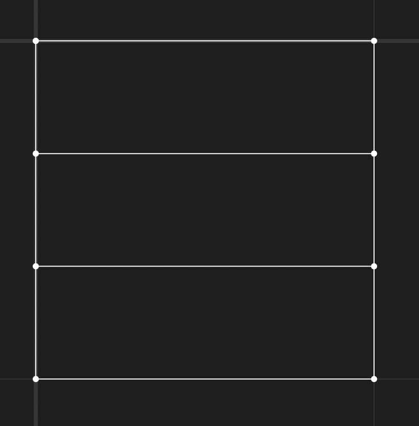
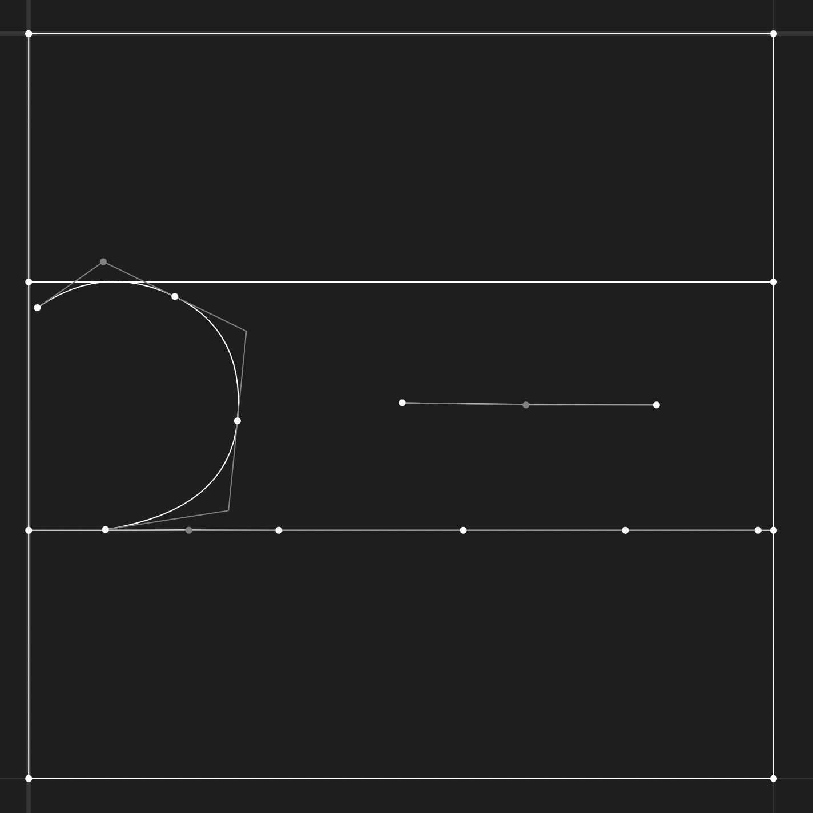

# Creating a new Shorthand Font

Creating a new shorthand font is no means a simple task. There is a lot of SVG math work involved. Previous experience with SVGs or graph design is recommended, but not necessarily required. Previous experience with writing code in Typescript is also recommended, but not necessarily required.

## Setup

To add a new font, begin by setting up the files properly before diving into the math part.

* Create a new folder  `src/shorthandFonts/<name>` where the name of your font is unique.
* Create a new typescript file `src/shorthandFonts/<name>/shorthandFont<name>.ts`.
* This file should export a single variable called `shorthand<name>` which is of type `ShorthandFont`.
* For organization, we recommend using the same code format as the standard font, which is to have each phoneme generated in its own function and then calling those functions in your variable declaration.
* Add the name of your font to the `ShorthandFontType` enum in the `src/shorthandFonts/shorthandFonts.ts:6` file.
* Add a case for your font to the `getFont` switch function in the same file.

You can copy the code for the standard font and change the names from `standard` to your font name if that is easier.

## Consonants

Consonants are the backbone of shorthand Tsevhu, so we recommend starting by designing the consonants using placeholder vowels and form marks from another font. 

All consonants are designed inside a square from `(0, 0)` to `(1, 1)` with horizontal lines at the 3rd marks.

Consonants in the standard font have the baseline at the 2/3rds line (`0.6666`). The consonants that live above the baseline cap at the 1/3 line (`0.3333`) while the consonants that live below the baseline cap at the bottom (`1`). The area in the first third is reserved for vowels.

For example, this is the base form of the `M` consonant:

It is formed from three curves, the cresent and two horizontal lines.
